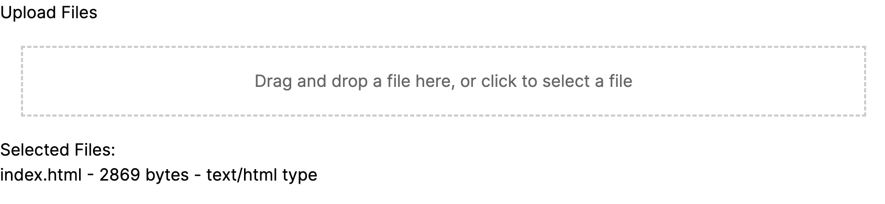

# File Drop Box - NEXT.JS



This provides a simple interface for users to select files by dragging and dropping files directly into the browser window.

## Features

- **Drag-and-Drop Upload**: Users can drag files from their computer and drop them into the designated area on the webpage to upload.
- **File Selection Dialog**: By clicking on the upload area, users can also trigger the file selection dialog to upload files.
- **Multiple File Support**: The app supports uploading multiple files at once from the file selection dialog.

## Getting Started

Follow these instructions to get the app up and running on your local machine for development and testing purposes.

### Prerequisites

- [Node.js](https://nodejs.org/en/) (version 12 or newer)
- [npm](https://www.npmjs.com/) (usually comes with Node.js)

### Installation

1. Clone the repository,
2. Navigate to the app directory,
3. Install the dependencies,
4. Start the development server,

```bash
git clone https://github.com/Maccee/FileDropBox.git
cd FileDropBox
npm install
npm run dev
```

5. Open [http://localhost:3000](http://localhost:3000) to view the app in the browser.

## Usage

- **To Select Files**: Drag and drop your files into the drop zone or click on the drop zone to open the file selection dialog and choose files.
- **View Selected Files**: After selected, the files will be listed below.

## Contributing

Contributions are welcome, and any contributions you make are **greatly appreciated**.
